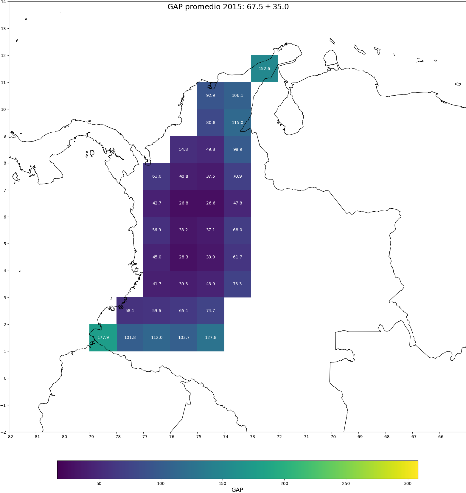
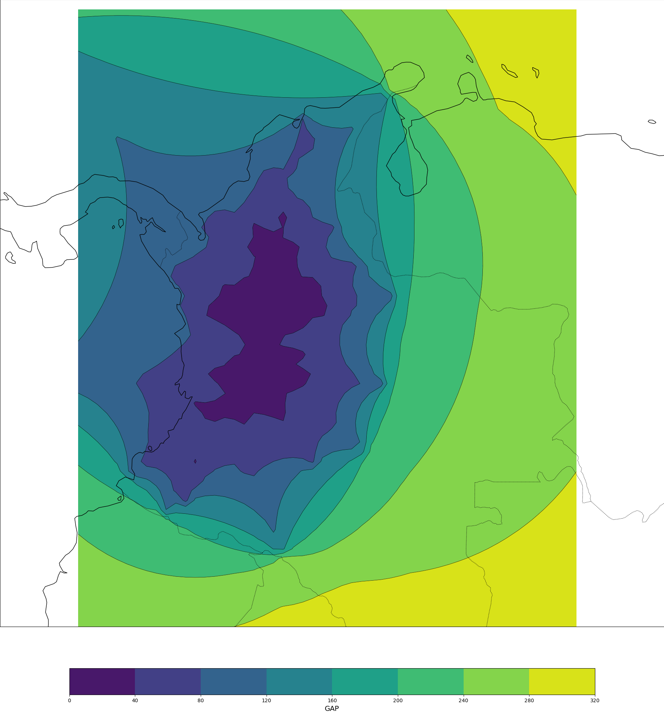

# ISOGAP

The main script (gap_heatmap.py) has 3 commands that allow to perform the following tasks:
1. [**grids**] Compute azimuthal GAP over a grid (in Colombia) taking into account the distribution of the seismological network (in this particular case, the Colombian National Seismological Network)
2. [**heatmaps**] With those grids created in the previous step, generates a heatmap and a contour plot over Colombian geographical map.
3. [**g-h**] Perform the 2 above.

### Heatmap example


### Countour map example


## Installation
### Prerequisites
* python 3.7 - 3.9

For non anaconda python installations:
```
$ apt-get install libproj-dev proj-data proj-bin  
$ apt-get install libgeos-dev  
$ pip install cython 
```

### Non anaconda users
Clone or download this repository and then type:

```
$ pip install -r requirements.txt
```

### Anaconda users
If you have an anaconda installation:

```
$ conda install -c scitools cartopy
$ pip install -r requirements.txt
```

## Usage

To get the command names, type:
```
$ python gap_heatmap.py --help
```

To get help about each command, type:
```
$ python gap_heatmap.py [command] --help
```
